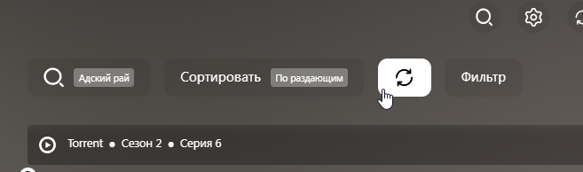

# AI Документация
[](https://deepwiki.com/egorrrmiller/jacred)

# JacRed

Торрент-трекер агрегатор.

---

## 🚀 1. Настройка окружения (.env)

Создайте файл `.env`. Параметры определяют настройки контейнеров и подключения к БД.

### Описание параметров
| Переменная | Описание |
|------------|----------|
| `APP_PORT` | Внешний порт приложения |
| `HEALTHCHECK_PORT` | Порт для проверки здоровья контейнера |
| `TZ`, `UMASK` | Часовой пояс и маска прав доступа |
| `DB_*` | Параметры подключения к Postgres (Host, Port, Name, User, Password) |
| `DB_CONNECTION` | Полная строка подключения (перекрывает параметры `DB_*`) |
| `IMAGE_NAME` | Тег Docker-образа |
| `CONFIG_PATH` | Путь к локальному файлу конфигурации |

### Пример файла .env
```env
APP_PORT=9117
HEALTHCHECK_PORT=9117
CONFIG_PATH=./config.yml

DB_HOST=db
DB_PORT=5432
DB_NAME=jacred
DB_USER=jacred
DB_PASSWORD=jacred
# DB_CONNECTION=Host=db;Port=5432;Database=jacred;Username=jacred;Password=jacred;Timeout=30;CommandTimeout=60;

IMAGE_NAME=ghcr.io/egorrrmiller/jacred:latest
```

---

## 🐳 2. Docker Compose

Создайте файл `docker-compose.yml` рядом с `.env`.

```yaml
name: jacred

services:
  jacred:
    image: ${IMAGE_NAME:-ghcr.io/egorrrmiller/jacred:latest}
    container_name: jacred
    restart: unless-stopped
    depends_on:
      db:
        condition: service_healthy
    environment:
      TZ: ${TZ:-UTC}
      UMASK: ${UMASK:-0027}
      HEALTHCHECK_PORT: ${HEALTHCHECK_PORT:-9117}
      ConnectionStrings__DefaultConnection: ${DB_CONNECTION:-Host=db;Port=${DB_PORT:-5432};Database=${DB_NAME:-jacred};Username=${DB_USER:-jacred};Password=${DB_PASSWORD:-jacred};Timeout=30;CommandTimeout=60;}
    ports:
      - "${APP_PORT:-9117}:${APP_PORT:-9117}"
    volumes:
      - ${CONFIG_PATH:-./config.yml}:/app/config.local.yml:ro
    healthcheck:
      test: ["CMD-SHELL", "wget --quiet --spider http://127.0.0.1:${HEALTHCHECK_PORT:-9117}"]
      interval: 30s
      timeout: 15s
      retries: 3
      start_period: 45s

  db:
    image: postgres:16-alpine
    container_name: jacred-db
    restart: unless-stopped
    environment:
      POSTGRES_DB: ${DB_NAME:-jacred}
      POSTGRES_USER: ${DB_USER:-jacred}
      POSTGRES_PASSWORD: ${DB_PASSWORD:-jacred}
    expose:
      - "5432"
    # Раскомментируйте для доступа к БД снаружи
    # ports:
    #   - "${DB_PORT:-5432}:5432"
    volumes:
      - jacred-db:/var/lib/postgresql/data
    healthcheck:
      test: ["CMD-SHELL", "pg_isready -U ${DB_USER:-jacred} -d ${DB_NAME:-jacred}"]
      interval: 10s
      timeout: 5s
      retries: 5
      start_period: 30s

volumes:
  jacred-db:
```

---

## ⚙️ 3. Конфигурация приложения (config.yml)

Создайте файл `config.yml` рядом с `docker-compose.yml`. Файл монтируется в контейнер как `/app/config.local.yml`.
> Полный список категорий RuTracker доступен [здесь](https://github.com/egorrrmiller/jacred/tree/main/JacRed.Infrastructure/Services/Trackers/RuTracker/RuTrackers_categories.md).

```yaml
##### Настройка сервера
listen-ip: any          # IP для прослушивания (any = 0.0.0.0)
listen-port: 9117       # Порт веб-сервера
api-key: 'key'          # Ключ доступа к API
web: true               # Включить веб-интерфейс

cache:
  enable: true          # включение сохранения данных в кеш
  expiry: 15            # срок жизни данных в кеше (мин)
  auth-expiry: 1        # срок жизни аутентификационных данных в кеше (дни)

proxy:
  list:
    # Пример 1: SOCKS5 прокси без авторизации
    - url: 'socks5://111.111.1.1:8000'

    # Пример 2: HTTP прокси с авторизацией
    - url: 'http://222.222.2.2:9000'
      username: 'proxy_user'
      password: 'proxy_password'
      
    # Пример 3: Еще один SOCKS5 прокси без авторизации
    # username и password можно опустить, если они не требуются
    - url: 'socks5://123.123.1.1:8080'

##### Настройка выдачи
max-result-count: 250   # Лимит результатов в ответе
merge-duplicates: true  # Схлопывать дубликаты по InfoHash
merge-num-duplicates: true # Схлопывать дубликаты серий/сезонов

##### Настройка обновления торрентов
refresh:
  enable: false         # Включить фоновое обновление по query
  timeout: 60           # Интервал проверки (мин)
  older-than-min: 120   # Обновлять торренты старше N минут
  limit: 100            # Количество торрентов за один проход

# Интеграция с TorrServer (ffprobe/языки)
ffprobe:
  enable: true          # Включить получение метаданных
  timeout: 10           # Таймаут запроса (мин)
  tsuri: 'http://localhost:5665' # Адрес TorrServer
  batch-size: 5         # Торрентов за один проход
  attempts: 3           # Попыток на один торрент
  authorization:
    login: 'login'      # Логин TorrServer
    password: 'password' # Пароль TorrServer

##### Настройка трекеров

rutracker:
  enable-search: true   # Включить поиск

  popular:
    enable: true        # Включить парсинг популярных
    timeout: 30         # Интервал запуска джобы (мин)
    max-pages: 5        # Глубина парсинга страниц
    categories: [ 111, 222 ] # ID категорий для парсинга

  authorization:
    login: 'login'      # Логин на трекере
    password: 'pass'    # Пароль на трекере

nnmclub:
  enable-search: true   # Включить поиск

kinozal:
  enable-search: true   # Включить поиск

  authorization:
    login: 'login'      # Логин на трекере
    password: 'pass'    # Пароль на трекере

animelayer:
  enable-search: false  # Поиск выключен
    
  authorization:
    login: 'login'      # Логин на трекере
    password: 'pass'    # Пароль на трекере

rutor:
  enable-search: true   # Включить поиск

aniliberty:
  enable-search: true   # Включить поиск

megapeer:
  enable-search: true   # Включить поиск
```

---

## 🚀 4. Запуск

Запуск контейнеров в фоновом режиме:
```bash
docker-compose up -d --build
```

Если `.env` файл находится в другой директории:
```bash
docker-compose --env-file /path/to/.env up -d --build
```

---

## 📝 5. Примечания

**Миграции БД**: Выполняются автоматически при старте контейнера.

**Сброс данных**: Команда для полной переинициализации (с удалением базы данных):
```bash
docker-compose down -v && docker-compose up -d --build
```

---

## 🧩 Расширения для JacRed

> Для улучшения пользовательского опыта, JacRed предлагает установить следующий набор расширений в LAMPA:

1. ### [Принудительный поиск на торрент трекерах](https://egorrrmiller.github.io/fix_search.js)
   [Плагин](https://egorrrmiller.github.io/fix_search.js) позволяет начать принудительный поиск по включенным трекерам, исключив из алгоритма получение данных из кеша или базы данных. <br/>
   После обновления данных, выдача торрентов будет обновлена. <br/><br/>
   Дополнительно плагин убирает из запроса к JacRed параметр year для более полной выдачи раздач. Фильтрация по годам останется доступна через штатный интерфейс LAMPA на странице торрентов
   


2. ### [Подписка на обновление торрентов по карточке фильма, сериала](https://egorrrmiller.github.io/torrent_subscribe.js)
   > Требуется авторизация в CUB для корректной работы плагина.

   [Плагин](https://egorrrmiller.github.io/torrent_subscribe.js) добавляет кнопку отслеживания на страницу, по нажатию которой фильм/сериал будут добавлены в базу для фонового обновления раздач на включенных трекерах. <br/>
   Повторное нажатие позволит убрать фильм/сериал из списка отслеживаемых.
   
   
   
